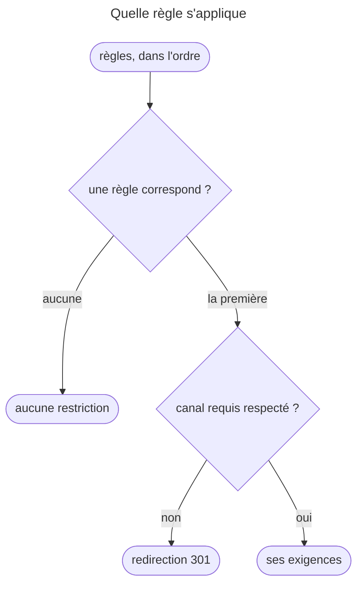
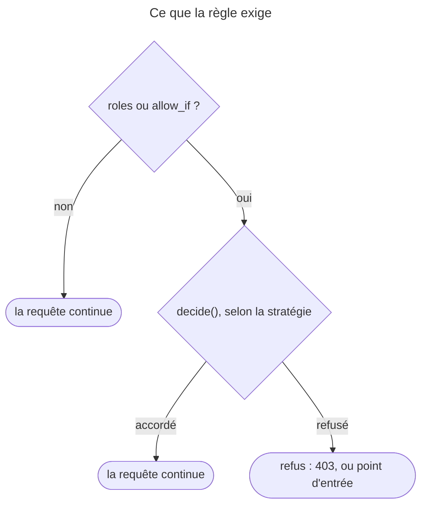

## Objectif

Protéger des URL par la configuration, connaître la règle d'ordre, et savoir
comment se combinent plusieurs exigences dans une même règle.

## La règle

```yaml
security:
    access_control:
        - { path: '^/admin/users', roles: ROLE_SUPER_ADMIN }
        - { path: '^/admin', roles: ROLE_ADMIN }
        - { path: '^/profile', roles: IS_AUTHENTICATED_FULLY }
```

Les règles sont évaluées **dans l'ordre**, et **seule la première qui
correspond est appliquée**. Les suivantes sont ignorées, même si elles
correspondent aussi.

D'où la règle d'écriture : **du plus spécifique au plus général**. Inverser les
deux premières lignes rendrait `ROLE_SUPER_ADMIN` inatteignable, puisque
`^/admin` capturerait déjà `/admin/users` — sans aucune erreur de
configuration.

Une URL qu'**aucune** règle ne couvre n'est pas restreinte par
`access_control`. Exécuté : `/whoami`, hors de toute règle, répond 200 à un
anonyme.

## Ce qui fait correspondre une règle

`path` est une expression régulière, pas un préfixe littéral, comparée **sans
la chaîne de requête** : un paramètre `?x=` ne peut pas être protégé ici.

| Clé | Ce qu'elle contraint |
|---|---|
| `path`, `host` | le chemin, l'hôte — expressions régulières |
| `ips` (ou `ip`) | l'adresse du client, masques acceptés |
| `port`, `methods` | le port, les méthodes HTTP |
| `route` | le nom de la route |
| `attributes` | des attributs de la requête, à égalité exacte |
| `request_matcher` | un service `RequestMatcherInterface` |

Tous les critères d'une même règle doivent correspondre. `request_matcher` ne
se combine avec aucun autre : SecurityBundle refuse la configuration
(« should not be specified alongside other options »).

## Ce que la règle exige

Une fois la règle choisie, trois options imposent l'accès :

- `roles` — passés comme attributs à `decide()`, avec la **requête** pour
  sujet ;
- `allow_if` — une expression, **ajoutée à la liste des attributs** ;
- `requires_channel` — exécuté : `https` sur une requête `http` donne une
  redirection **301** vers `https://…`.

Plusieurs exigences ne s'additionnent donc pas : elles sont soumises ensemble
à la stratégie de décision. Exécuté avec SecurityBundle 8.0.15 :

| Règle | `affirmative` (défaut) | `unanimous` |
|---|---|---|
| `roles: [ROLE_ADMIN, ROLE_EDITOR]`, utilisateur `ROLE_EDITOR` | 200 | 200 |
| `roles: ROLE_ADMIN` + `allow_if` vrai, utilisateur sans `ROLE_ADMIN` | **200** | 403 |
| même règle, visiteur anonyme | **200** | 401 |
| `roles: [ROLE_USER, IS_AUTHENTICATED_FULLY]`, utilisateur sans `ROLE_USER` | **200** | 403 |

Deux rôles ensemble valent « l'un ou l'autre » quelle que soit la stratégie, car
c'est le même votant qui les examine. Dès que deux votants interviennent — un
rôle et une expression, un rôle et un état d'authentification —, la stratégie
décide : « ou » en `affirmative`, « et » en `unanimous`. La documentation
l'avertit pour `roles` + `allow_if`.





## Ce que cela ne fait pas

`access_control` protège des **URL**. Il ne sait rien des objets : « l'auteur
peut modifier son article » ne s'y exprime pas — c'est le travail d'un votant.

Un refus produit une `AccessDeniedException`, traitée comme partout ailleurs :
403 pour un utilisateur connu, point d'entrée pour un anonyme.

## Pièges d'examen

**Seule la première règle correspondante s'applique** ; les autres ne sont pas
cumulées.

**Du plus spécifique au plus général**, sinon la règle fine devient inatteignable.

**`path` est une expression régulière**, comparée sans la chaîne de requête.

**`roles` + `allow_if` accorde si l'un des deux suffit**, avec la stratégie par
défaut.

**Aucune règle ne correspond : aucune restriction.**

**`access_control` ne remplace pas un votant** : il ignore les objets.

## Points clés

- Première correspondance gagnante ; ordonner du spécifique au général.
- Correspondance : `path`, `host`, `ips`, `port`, `methods`, `route`,
  `attributes`, ou un `request_matcher` seul.
- Exigence : `roles`, `allow_if`, `requires_channel` ; plusieurs attributs sont
  tranchés par la stratégie.
- Protège des URL, pas des objets.

## Sources officielles

- [How Does the Security access_control Work?](https://github.com/symfony/symfony-docs/blob/8.0/security/access_control.rst)
- [SecurityBundle 8.0, `SecurityExtension`](https://github.com/symfony/symfony/blob/8.0/src/Symfony/Bundle/SecurityBundle/DependencyInjection/SecurityExtension.php)
- [Security HTTP 8.0, `AccessListener`](https://github.com/symfony/symfony/blob/8.0/src/Symfony/Component/Security/Http/Firewall/AccessListener.php)
