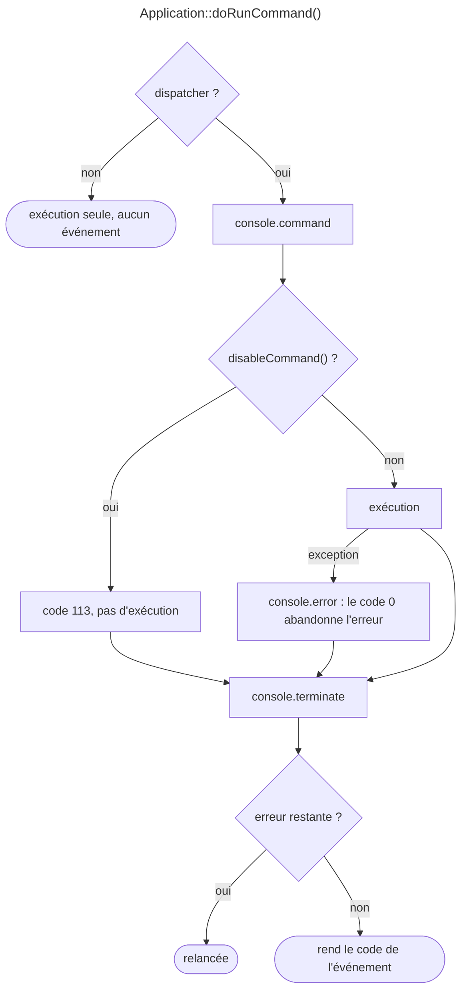

## Objectif

Intervenir autour de l'exécution d'une commande sans la modifier : journaliser,
mesurer, empêcher, rattraper une erreur.

## Prérequis

Le cycle d'une commande, et le dispatcher d'événements.

## Les quatre événements

`ConsoleEvents` déclare **quatre** événements — et une cinquième constante,
`ALIASES`, qui associe chaque classe d'événement à son nom pour que l'on puisse
s'abonner par la classe :

| Constante | Valeur | Quand |
|---|---|---|
| `COMMAND` | `console.command` | avant l'exécution |
| `SIGNAL` | `console.signal` | à la réception d'un signal POSIX |
| `ERROR` | `console.error` | une exception ou une erreur est remontée |
| `TERMINATE` | `console.terminate` | après l'exécution, quoi qu'il arrive |

Ils ne sont dispatchés que si l'`Application` possède un dispatcher. Dans une
application Symfony, FrameworkBundle le lui donne ; une `Application` construite
à la main ne dispatche rien tant qu'on n'a pas appelé `setDispatcher()`.

## L'ordre réel



Le point que l'examen teste : **`TERMINATE` est toujours atteint**, y compris
après une erreur. C'est donc le seul endroit fiable pour libérer une ressource
ou mesurer une durée d'exécution.

Exécuté avec Console 8.0.15, une `Application` munie d'un dispatcher :

| Cas | Événements | Code |
|---|---|---|
| succès | `COMMAND`, exécution, `TERMINATE:0` | 0 |
| `disableCommand()` | `COMMAND`, **`TERMINATE:113`** — pas d'exécution | 113 |
| exception | `COMMAND`, exécution, `ERROR`, `TERMINATE:1` | 1 |
| exception, `setExitCode(0)` sur `ERROR` | … `ERROR`, `TERMINATE:0` | 0 |
| succès, `setExitCode(1)` sur `TERMINATE` | … `TERMINATE:0` | **1** |
| `__invoke(): void` | … `ERROR` (`TypeError`), `TERMINATE:1` | `TypeError` relancée |
| exception, **sans** dispatcher | exécution seule | 1 |

## `COMMAND` — avant

`ConsoleCommandEvent` donne accès à la commande, à l'entrée et à la sortie avant
qu'elles ne lui soient passées. On peut donc y ajouter une option, forcer une
verbosité — ou empêcher l'exécution :

```php
$event->disableCommand();
```

La commande n'est alors pas lancée, et le processus sort avec le code
`ConsoleCommandEvent::RETURN_CODE_DISABLED`, qui vaut **113**. Cette valeur
particulière permet de distinguer « refusée » de « échouée » (1).

## `ERROR` — rattraper

`ConsoleErrorEvent` porte l'erreur et le code de sortie :

```php
$event->getError();
$event->setError(new \RuntimeException('message plus clair'));
$event->setExitCode(0);
```

`setExitCode(0)` a un effet fort : l'`Application` considère alors qu'il n'y a
plus d'erreur à propager, et l'exception est abandonnée. C'est le mécanisme qui
permet de traiter une erreur attendue sans faire échouer le processus.

`ERROR` couvre tout `Throwable` — les erreurs PHP autant que les exceptions.
Exécuté : une `TypeError` déclenche `ERROR` puis `TERMINATE`, et n'est relancée
qu'ensuite ; c'est `Application::run()`, qui n'attrape pas les `Error` par
défaut, qui la laisse remonter.

## `TERMINATE` — après

`ConsoleTerminateEvent` porte le code de sortie et permet de le remplacer :

```php
$event->getExitCode();
$event->setExitCode(1);
```

Le code final du processus est celui que porte cet événement **après** le
dispatch, pas celui qu'a retourné la commande. Un écouteur de `TERMINATE` peut
donc transformer un succès en échec, et réciproquement.

Il expose aussi `getInterruptingSignal()` : non nul quand la commande a été
interrompue par un signal.

## `SIGNAL` — pendant

Émis à la réception d'un signal POSIX (`SIGINT`, `SIGTERM`). `ConsoleSignalEvent`
expose `getHandlingSignal()`, `setExitCode()` et `abortExit()` — cette dernière
laisse la commande poursuivre au lieu de terminer le processus. Le cas d'usage
est l'arrêt propre d'un travailleur de longue durée.

## S'abonner

Comme pour tout autre événement :

```php
class CommandLogger implements EventSubscriberInterface
{
    public static function getSubscribedEvents(): array
    {
        return [ConsoleEvents::TERMINATE => 'onTerminate'];
    }
}
```

## Pièges d'examen

**Quatre événements, pas cinq.** Il n'existe pas d'événement « après
`configure()` » ni d'équivalent console de `kernel.request`.

**`TERMINATE` est dispatché même après une erreur** — c'est sa raison d'être.

**`disableCommand()` produit le code 113**, pas 0 ni 1 — et `TERMINATE` est
quand même dispatché.

**`setExitCode(0)` sur `ERROR` avale l'exception** au lieu de la laisser remonter.

**Pas de dispatcher, pas d'événements** : une `Application` autonome est muette.

## Points clés

- `COMMAND`, `SIGNAL`, `ERROR`, `TERMINATE` — quatre événements déclarés par
  `ConsoleEvents`, plus la table `ALIASES`.
- Ordre : `COMMAND` → exécution → (`ERROR`) → `TERMINATE`, toujours.
- `disableCommand()` empêche l'exécution et sort avec 113.
- `ERROR` peut remplacer l'erreur ou l'annuler par `setExitCode(0)`.
- Le code de sortie final est celui porté par `TERMINATE`.

## Sources officielles

- [`ConsoleEvents`, branche 8.0](https://github.com/symfony/symfony/blob/8.0/src/Symfony/Component/Console/ConsoleEvents.php)
- [`Application::doRunCommand`, branche 8.0](https://github.com/symfony/symfony/blob/8.0/src/Symfony/Component/Console/Application.php)
- [Using Events](https://github.com/symfony/symfony-docs/blob/8.0/components/console/events.rst)
